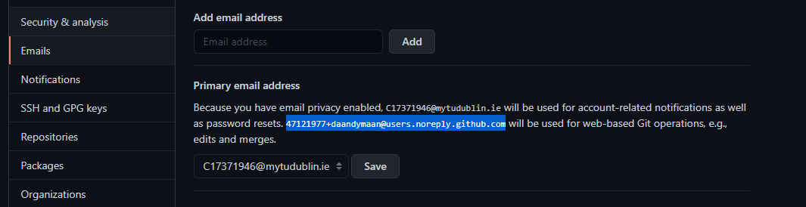

# Git Bash Account Setup 

Make sure you have a GitHub Student account 

Set up GIT username 
```
git config --global user.name "usernameHere"

```
Confirm you have set it up 
```
git config --global user.name

```
___
Next you have to find your GitHub commit email address 

Log into your GitHub account and click on your profile from this click on the settings link

Go to primary email address, there should be an email with **noreply.noreply.github.com**

 

This is the email that will be used for Git merges and commits 

Then you can add this Git email to your Git bash 

Open Git Bash and enter the following command 

```
git config --global user.email "email@example.com"

```
Confirm you have set it up 
```
git config --global user.email

```

Once this is complete you can start using Git 
