# Git Bash Install
**Install Here** : https://git-scm.com/downloads 

Select a location for Git to go, preferably on the your main drive C as shown in the figure below 

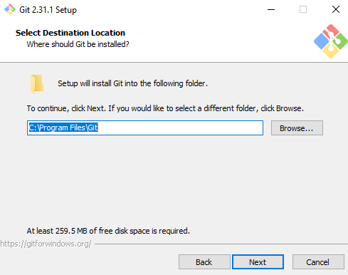 

Next is to select the correct components, important to select the “Git bash here” and “Git GUI here” as seen below 

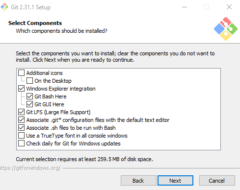 

Next keep the default Git value for the start menu folder 

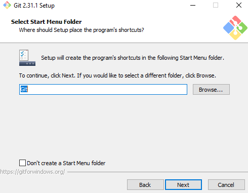 

Use the Vim editor, this is within Git bash console and is the default 

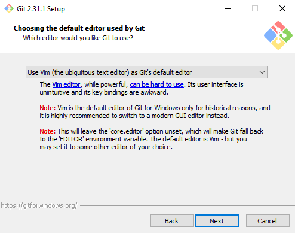 

Choose let git decide 

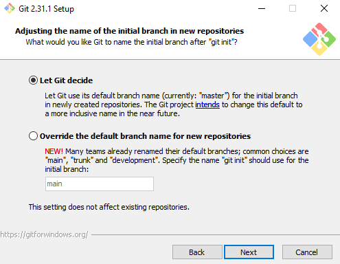 

Important to choose Git from command line as you can use git in other software which we will use later

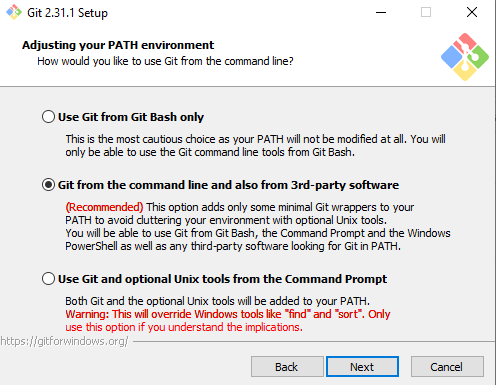 

Use OpenSSH, this might be the only option for you select it

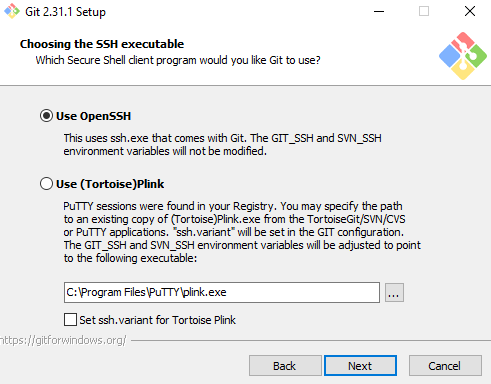 

Use the OpenSSL library 

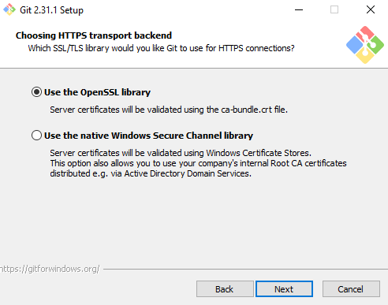 

Use the Windows checkout style, this is just referencing how each operating system deals with the end of line character 

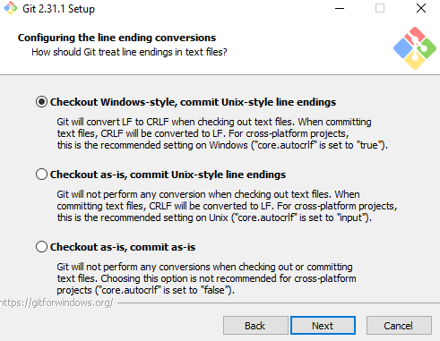 

Use MinTTY 

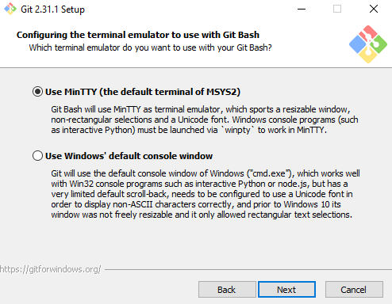 

Next is telling git how to deal with the git pull command chose the default option 

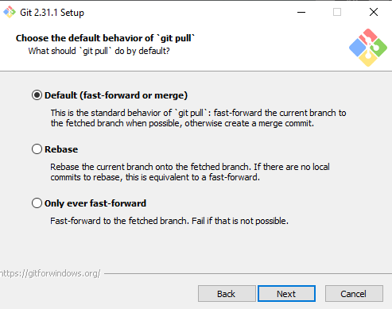 

The credential helper is important chose the Git Credential Manager **Core**

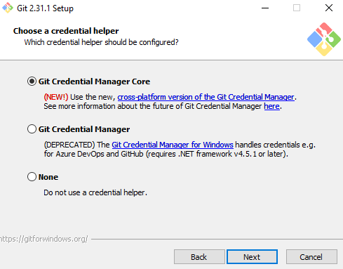 

Finally choose enable file system caching

 

This is the complete setup of Git bash 
