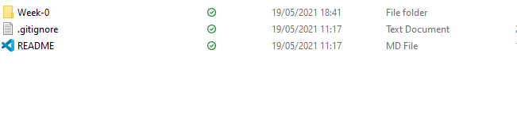
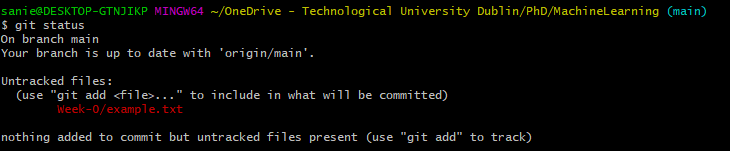

# Git 101 

Really useful cheat sheet which contains all the keywords and commands needed for Git Bash

[Git command cheatsheet](https://education.github.com/git-cheat-sheet-education.pdf)

First you want to make a copy of this repo on your PC so you can edit and update files 
Create a new folder in your Documents folder or any location you want 
Right click within the current folder you are in and select the **Git Bash here** 
This allows you to open a bash terminal from within the current directory you are in
Enter the following command

```
git clone https://github.com/daandymaan/Machine-Learning-for-the-Sustainable-Production-of-Pharmaceuticals.git
```
This command will clone the contents of the directory onto your PC 

 

After this create a new file in the folder Week-0 
Each week's work will have a designated folder so its easy to track progress each week 
The new file should be called **example.txt**

In this file enter the following text 
```
Hello World! 
```
Save the file and then close it 
Open the Git Bash terminal in the main repo folder 
Enter the following command:
```
git status
```
This command will show you the current changes made to the repo 

As you can see the file that was just created appears.

 


Currently Git is not tracking this file, to track this file we have to add this file, to add all untracked files we can use this command:
```
git add .
```
The . symbolises all, if you want to add a specific file you can use the filename instead of the . like so 
```
git add Week-0/example.txt
```
You have to use the correct path, if you enter the first few letters then press the tab key it will autocomplete 
Most of the time you will be using the . key but sometimes it is good to specify certain files for different commits which brings us to the next step 

Commiting is the process of saving the added files pretty much, with each commit you add a commit message

Commit messages are quite important they help specify the content which you are publishing most of the time 

Working on this repo we'll have a commit message format 

#x ActionWord BriefDescription 

#x = This will be the issue number, issues are visible within the repo beside the <>Code on the repo, each commit will have an associated number for it 

ActionWord = Added / Updated / Removed are some examples 

Description = Just some more information of the files added updated or deleted. 


For this week the issue number is #1 so for the commit meesage you'll enter something like this 
```
git commit -m "#1 Added an example text file" 
```
commit is the keyword used to specify that a commit is being processed 

-m is used to specify the message in the commit 

Finally the last step is publish these changes to the online repo 

This is done with the following command 

```
git push
```

Next make a slight to the content within the file we just created after this repeat the simliar process

```
git add .
git commit -m "#1 Updated example file"
git push
```

There are plenty more git commands that we will be using but for now these are the main ones 

After this is complete check on the GitHub repo that the commits were published 


This is the end of this week's work, this week was just to get all the software we would need installed and some familarity with Git 
